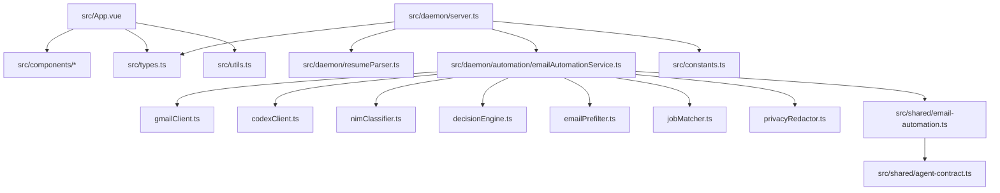
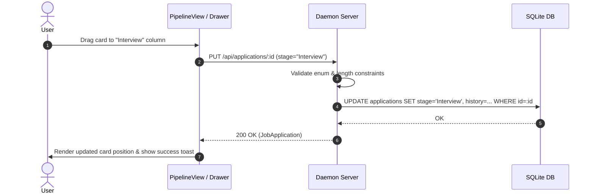
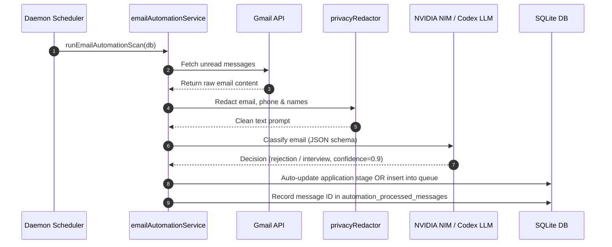
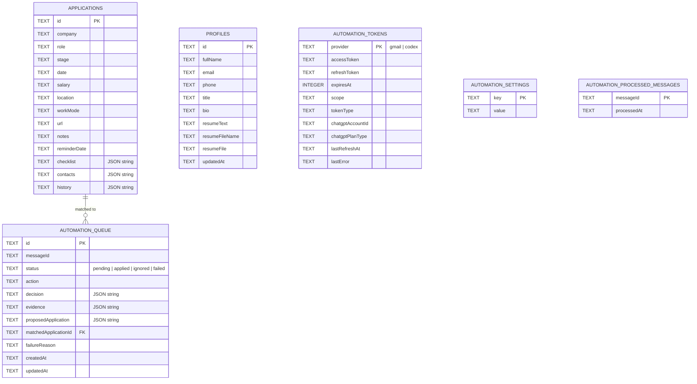
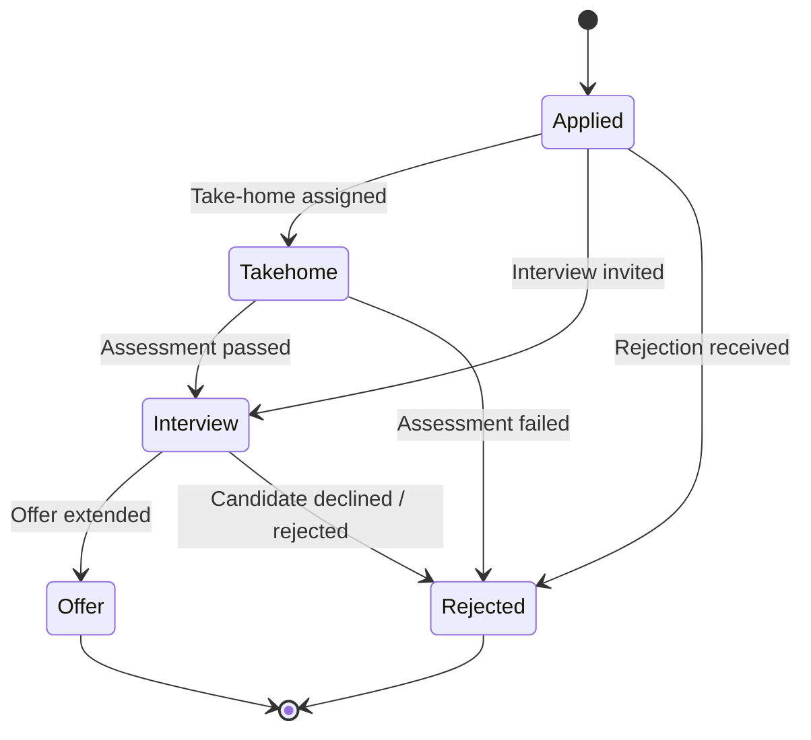

# Codebase Guide — Job Application Tracker

Welcome to the **Job Application Tracker** codebase guide. This comprehensive reference is designed to onboard developers, architects, and maintainers to the architecture, domain models, data flows, APIs, and background processing systems without requiring a manual read of every repository file.

---

## 1. Executive Summary

**Job Application Tracker** (also known internally as `jobapp` / `job-application-tracker`) is a full-stack personal career management and intelligent job search automation platform. It enables job seekers to track their application pipeline (Applied, Take-home, Interview, Offer, Rejected), record company notes and contacts, set follow-up reminders, analyze response metrics, and automatically scan incoming Gmail messages using LLM classification to auto-update job application statuses.

The repository is structured as a **Modular Monolith** with a clear client-server separation:
1. **Frontend Client**: A Vue 3 SPA built with Vite, TypeScript, Vue Router, and custom reactive components.
2. **Backend Daemon**: An Express + SQLite + WebSockets server (`src/daemon/server.ts`) running on Node 20 with native TypeScript support (`tsx`), managing persistence, OAuth token flows, background email polling, and AI model proxying.
3. **AI Classification & Automation Service**: An integrated automation sub-system (`src/daemon/automation/`) capable of connecting to **NVIDIA NIM** (e.g., Llama 3.1 405B) or **OpenAI ChatGPT Plus / Codex** via OAuth PKCE to classify emails with zero API key cost for ChatGPT Plus subscribers.

### Codebase Understanding Confidence
- **Confidence Rating**: **High (95%)**
- **Basis for Assessment**: Exhaustive inspection of all source files in `src/`, configuration manifests (`package.json`, `vite.config.ts`, `tsconfig.json`), deployment scripts (`Dockerfile`, `docker-compose.yml`), environment specs (`.env.example`), and complete execution of the test suite (7/7 contract guard tests and 59/59 Vitest integration tests passed).

---

## 2. Product & Business Context

### Product Objective
Job hunting involves managing dozens of concurrent job applications across multiple portals. Candidates frequently miss critical interview invitations, take-home assignments, or rejection updates buried in their email inboxes. **Job Application Tracker** solves this by providing a unified Kanban pipeline alongside an intelligent AI agent that continuously monitors inbox updates, classifies incoming emails, and either automatically transitions job application stages or queues uncertain emails for human review.

### Primary User Personas
- **Active Job Seeker**: Manages 20+ active job applications; needs Kanban visualization, reminder alerts, and automated email processing.
- **Privacy-Conscious Developer**: Prefers local SQLite storage over third-party SaaS databases; requires local privacy redaction before email text is sent to AI models.

### Key Workflows
1. **Pipeline & Application Management**: View Kanban board ([OverviewView.vue](file:///e:/webappgithub/jobapp/src/components/OverviewView.vue), [PipelineView.vue](file:///e:/webappgithub/jobapp/src/components/PipelineView.vue)), open application detail drawer ([ApplicationDrawer.vue](file:///e:/webappgithub/jobapp/src/components/ApplicationDrawer.vue)), edit contacts, checklist items, salary, location, work mode, and follow-up dates.
2. **PDF Resume Import**: Upload a PDF resume in [ProfileView.vue](file:///e:/webappgithub/jobapp/src/components/ProfileView.vue); backend extracts raw text using `pdf-parse` in [resumeParser.ts](file:///e:/webappgithub/jobapp/src/daemon/resumeParser.ts) and extracts structured contact info and summary using regex parsing heuristics.
3. **Gmail Integration & OAuth Setup**: Connect Gmail via Google OAuth 2.0 in [AutomationView.vue](file:///e:/webappgithub/jobapp/src/components/AutomationView.vue).
4. **AI Inbox Scanning & Classification**: Background daemon polls Gmail inbox every 10 minutes (`GMAIL_POLL_INTERVAL_MS`), redacts PII using [privacyRedactor.ts](file:///e:/webappgithub/jobapp/src/daemon/automation/privacyRedactor.ts), classifies emails via NVIDIA NIM or OpenAI Codex, and executes status changes or pushes items to the Review Queue.
5. **Human-in-the-Loop Review**: Users inspect pending items in the automation queue, approving, ignoring, or manually linking emails to existing job applications.

---

## 3. Technology Stack

| Area | Technology | Version | Purpose | Evidence |
| :--- | :--- | :--- | :--- | :--- |
| **Frontend Framework** | Vue.js | `^3.5.13` | Reactive Component UI Framework | [package.json:L21](file:///e:/webappgithub/jobapp/package.json#L21) |
| **Frontend Routing** | Vue Router | `^4.6.4` | Client-Side SPA Route Navigation | [src/router.ts:L44-L47](file:///e:/webappgithub/jobapp/src/router.ts#L44-L47) |
| **Build Tool & Bundler** | Vite | `^6.0.5` | Fast Frontend HMR Dev Server & Bundler | [vite.config.ts:L6-L24](file:///e:/webappgithub/jobapp/vite.config.ts#L6-L24) |
| **Language & Typechecker**| TypeScript / vue-tsc | `^5.7.2` / `^2.2.0` | Strict Static Typing & Vue Component Typechecking | [tsconfig.json:L1-L20](file:///e:/webappgithub/jobapp/tsconfig.json#L1-L20) |
| **Backend Runtime** | Node.js + tsx | `Node 20` / `^4.22.3` | Server Runtime with Native TS Execution | [Dockerfile:L52](file:///e:/webappgithub/jobapp/Dockerfile#L52), [package.json:L13](file:///e:/webappgithub/jobapp/package.json#L13) |
| **HTTP Web Server** | Express | `^5.2.1` | REST API Server for Applications, Profiles & Automation | [src/daemon/server.ts:L86-L96](file:///e:/webappgithub/jobapp/src/daemon/server.ts#L86-L96) |
| **WebSocket Server** | ws | `^8.21.0` | Real-time Push Notifications & Health Heartbeats | [src/daemon/server.ts:L844-L902](file:///e:/webappgithub/jobapp/src/daemon/server.ts#L844-L902) |
| **Database & Driver** | SQLite3 / sqlite | `^6.0.1` / `^5.1.1` | Embedded Relational Storage for Applications & OAuth | [src/daemon/server.ts:L204-L243](file:///e:/webappgithub/jobapp/src/daemon/server.ts#L204-L243) |
| **Document Parser** | pdf-parse | `^2.4.5` | Extractor for PDF Resume Text Parsing | [src/daemon/resumeParser.ts:L21-L32](file:///e:/webappgithub/jobapp/src/daemon/resumeParser.ts#L21-L32) |
| **Testing Framework** | Vitest & Node Test | `^4.1.7` / `Node Native` | Unit, Integration, Contract Guard, & E2E Testing | [package.json:L10-L12](file:///e:/webappgithub/jobapp/package.json#L10-L12) |
| **Containerization** | Docker & Docker Compose | Docker 20+ | Production Build & Multi-Stage Deployment Container | [Dockerfile:L1-L66](file:///e:/webappgithub/jobapp/Dockerfile#L1-L66), [docker-compose.yml:L1-L36](file:///e:/webappgithub/jobapp/docker-compose.yml#L1-L36) |

---

## 4. Repository Structure

```text
jobapp/
├── .agents/                    # Agent skills and automation tooling
├── .claude/                    # Claude workspace configuration & worktrees
├── .gemini/                    # Gemini AI session context & brain logs
├── scripts/
│   ├── dev.mjs                 # Developer environment runner (launches daemon + vite)
│   ├── dev-support.mjs         # Helper module for dev process management
│   └── dev-support.test.mjs    # Vitest tests for dev environment helpers
├── src/
│   ├── App.vue                 # Core Application layout, navigation header & toast notifications
│   ├── main.ts                 # Vue application entry point
│   ├── router.ts               # Vue Router configuration (/overview, /pipeline, /analytics, etc.)
│   ├── style.css               # Global Vanilla CSS styling tokens & custom UI variables
│   ├── types.ts                # Primary TypeScript interfaces (JobApplication, UserProfile, Stage)
│   ├── utils.ts                # Date formatters, stage color matchers, change log generator
│   ├── constants.ts            # Application constant arrays (STAGES, WORK_MODES, STAGE_ICONS)
│   ├── components/             # Vue view components
│   │   ├── OverviewView.vue    # Dashboard metric overview & quick action widgets
│   │   ├── PipelineView.vue    # Interactive Kanban drag-and-drop pipeline board
│   │   ├── AnalyticsView.vue   # Application response rate, stage conversion & chart metrics
│   │   ├── AutomationView.vue  # Gmail OAuth, Codex/NIM AI classifier configuration & review queue
│   │   ├── ProfileView.vue     # User profile editor & PDF resume parser upload form
│   │   ├── ApplicationDrawer.vue # Modal drawer for creating/editing job applications & notes
│   │   └── Toast.vue           # Floating notification toast component
│   ├── daemon/                 # Backend Node.js service
│   │   ├── server.ts           # Express HTTP server + WebSocket daemon entry point
│   │   ├── server.test.ts      # Integration tests for server REST endpoints & WebSockets
│   │   ├── dev-server.test.ts  # Integration test verifying Vite dev server backend proxying
│   │   ├── resumeParser.ts     # PDF buffer extraction & resume structured fields regex parser
│   │   ├── resumeParser.test.ts# Unit tests for resume parsing logic
│   │   └── automation/         # AI Email Classifier & Automation Engine
│   │       ├── emailAutomationService.ts # Main orchestration service for Gmail polling & LLM scan
│   │       ├── emailAutomation.test.ts    # Comprehensive test suite for email automation
│   │       ├── gmailClient.ts           # Google OAuth 2.0 & Gmail REST API integration client
│   │       ├── codexClient.ts           # OpenAI Codex / ChatGPT Plus OAuth & SSE streaming client
│   │       ├── nimClassifier.ts         # NVIDIA NIM API integration client for Llama 3 models
│   │       ├── decisionEngine.ts        # Business rules engine mapping LLM decisions to DB actions
│   │       ├── emailPrefilter.ts        # Heuristic pre-filter ignoring non-job emails
│   │       ├── jobMatcher.ts            # Fuzzy matching engine linking incoming emails to job apps
│   │       └── privacyRedactor.ts       # PII redactor removing emails, phones, links before LLM call
│   └── shared/                 # Shared contracts & runtime validators
│       ├── agent-contract.ts   # Agent scoring schemas, action envelopes & runtime type guards
│       ├── email-automation.ts # Email decision schemas, queue interfaces & JSON schemas
│       └── contract-test.ts    # Native Node contract guard validator suite
├── Dockerfile                  # Production multi-stage Docker build specification
├── docker-compose.yml          # Container deployment specification with persistent volume mounts
├── package.json                # Project dependencies, scripts, and package metadata
├── vite.config.ts              # Vite bundler configuration & backend API proxy definition
└── tsconfig.json               # TypeScript compiler options (ES2022, NodeNext resolution)
```

---

## 5. System Architecture

### Architecture Pattern
The project implements a **Decoupled Client-Daemon Architecture**:
- **Frontend SPA**: Runs in the user's browser, handling reactive UI state, modal drawers, notifications, and client routing. Communicates with the daemon over local HTTP REST calls (`/api/...`) and WebSockets (`ws://localhost:1455`).
- **Backend Daemon**: A standalone Node.js process managing data persistence in SQLite (`jobs.db`), maintaining OAuth tokens, executing background timers, redacting sensitive user data, and proxying LLM requests.

```mermaid
graph TD
    subgraph Browser ["Frontend Browser (Vue 3 SPA)"]
        UI[App.vue / Views]
        Router[Vue Router]
        Drawer[ApplicationDrawer.vue]
        WSClient[WebSocket Listener]
    end

    subgraph Daemon ["Backend Daemon (Node.js / Express)"]
        Server[Express Server (server.ts)]
        WSServer[WebSocket Server (ws)]
        SQLite[(SQLite Database jobs.db)]
        ResumeParser[PDF Resume Parser]
        
        subgraph AutomationEngine ["Automation Engine (emailAutomationService.ts)"]
            GmailClient[Gmail OAuth & REST Client]
            Redactor[PII Privacy Redactor]
            Prefilter[Email Heuristic Prefilter]
            Matcher[Job Matcher Engine]
            DecisionEngine[Decision Business Engine]
            
            subgraph AIAdapters ["AI Classifier Providers"]
                NIM[NVIDIA NIM Client]
                Codex[OpenAI Codex / ChatGPT Client]
            end
        end
    end

    subgraph External ["External Cloud Services"]
        GoogleOAuth[Google Cloud OAuth 2.0]
        GmailAPI[Gmail API v1]
        NvidiaNIM[NVIDIA NIM Endpoint]
        OpenAICodex[OpenAI / ChatGPT OAuth & Codex API]
    end

    UI -->|REST /api| Server
    WSClient <-->|WebSocket ws://| WSServer
    Server --> SQLite
    Server --> ResumeParser
    Server --> AutomationEngine
    
    GmailClient -->|OAuth 2.0| GoogleOAuth
    GmailClient -->|REST Fetch| GmailAPI
    NIM -->|HTTPS POST| NvidiaNIM
    Codex -->|OAuth PKCE / SSE| OpenAICodex
```

---

## 6. Module Catalog

### Overview Catalog
| Module | Responsibility | Entry Points | Data Owned | Dependencies | Status |
| :--- | :--- | :--- | :--- | :--- | :--- |
| **Frontend UI** | Application visualization, Kanban, profile settings | [src/App.vue](file:///e:/webappgithub/jobapp/src/App.vue) | Local component state | REST API, WebSockets | Production |
| **Daemon Server** | REST routes, WS heartbeats, SQLite DB lifecycle | [src/daemon/server.ts](file:///e:/webappgithub/jobapp/src/daemon/server.ts) | `applications`, `profiles` | SQLite3, Express, WS | Production |
| **Resume Parser** | Raw PDF text extraction & regex field parsing | [src/daemon/resumeParser.ts](file:///e:/webappgithub/jobapp/src/daemon/resumeParser.ts) | Ephemeral PDF buffers | `pdf-parse` | Production |
| **Email Automation** | Gmail polling, AI classification, queue management | [src/daemon/automation/emailAutomationService.ts](file:///e:/webappgithub/jobapp/src/daemon/automation/emailAutomationService.ts) | `automation_tokens`, `automation_queue`, `automation_settings` | GmailClient, NIM/Codex, SQLite | Production |
| **Gmail Integration** | Google OAuth token refresh & email fetching | [src/daemon/automation/gmailClient.ts](file:///e:/webappgithub/jobapp/src/daemon/automation/gmailClient.ts) | OAuth tokens | Node Native Fetch | Production |
| **OpenAI Codex Client** | OAuth PKCE flow & ChatGPT Plus SSE streaming | [src/daemon/automation/codexClient.ts](file:///e:/webappgithub/jobapp/src/daemon/automation/codexClient.ts) | Codex OAuth tokens | Node Native Fetch | Production |
| **NVIDIA NIM Client** | Llama model classification proxy | [src/daemon/automation/nimClassifier.ts](file:///e:/webappgithub/jobapp/src/daemon/automation/nimClassifier.ts) | API keys in settings | Node Native Fetch | Production |
| **Shared Contracts** | Shared type definitions & runtime type guards | [src/shared/agent-contract.ts](file:///e:/webappgithub/jobapp/src/shared/agent-contract.ts) | Schema contracts | None | Production |

---

## 7. Module Dependency Map



---

## 8. Critical User & Business Flows

### Flow 1: Create & Update Job Application Pipeline Stage
- **Trigger**: User fills form in `ApplicationDrawer.vue` or drags a card across columns in `PipelineView.vue`.
- **Preconditions**: Backend daemon is running.
- **Main Flow**:
  1. Frontend creates/updates candidate payload.
  2. Sends `POST /api/applications` or `PUT /api/applications/:id`.
  3. Backend validates required string lengths and enum stages in [server.ts:L283-L301](file:///e:/webappgithub/jobapp/src/daemon/server.ts#L283-L301).
  4. Database executes SQL `INSERT` or `UPDATE` into `applications`.
  5. Response 200/201 returns saved object; UI appends activity log entry.



### Flow 2: Automated Email Scan & AI Decision Processing
- **Trigger**: Periodic background timer (`GMAIL_POLL_INTERVAL_MS`) or manual click on "Run Scan" in `AutomationView.vue`.
- **Preconditions**: Gmail OAuth and an AI provider (NIM or Codex) are configured.
- **Main Flow**:
  1. `runEmailAutomationScan(db)` in [emailAutomationService.ts:L980](file:///e:/webappgithub/jobapp/src/daemon/automation/emailAutomationService.ts#L980) checks for valid tokens.
  2. Fetches recent messages from Gmail API via `listRecentGmailMessages`.
  3. Filters out already processed message IDs present in `automation_processed_messages`.
  4. Runs heuristic `isLikelyJobEmail(msg)` pre-filter.
  5. Redacts PII using `buildRedactedEmailContent(msg)` in [privacyRedactor.ts](file:///e:/webappgithub/jobapp/src/daemon/automation/privacyRedactor.ts).
  6. Sends redacted text to configured LLM (NIM or Codex).
  7. Evaluates returned structured JSON `EmailAutomationDecision`.
  8. If confidence >= 0.75 and action is clear (e.g. `mark_rejected`), automatically updates application in SQLite database. Otherwise, pushes item to `automation_queue` for manual review.



---

## 9. API & Interface Surface

### REST API Endpoints

| Method | Path | Auth | Purpose | Evidence |
| :--- | :--- | :--- | :--- | :--- |
| `GET` | `/api/health` | None | Service health & timestamp check | [server.ts:L248-L250](file:///e:/webappgithub/jobapp/src/daemon/server.ts#L248-L250) |
| `GET` | `/api/applications` | None | Fetch all job applications | [server.ts:L253-L277](file:///e:/webappgithub/jobapp/src/daemon/server.ts#L253-L277) |
| `POST` | `/api/applications` | None | Create a new job application | [server.ts:L280-L330](file:///e:/webappgithub/jobapp/src/daemon/server.ts#L280-L330) |
| `PUT` | `/api/applications/:id` | None | Update an existing job application | [server.ts:L333-L405](file:///e:/webappgithub/jobapp/src/daemon/server.ts#L333-L405) |
| `DELETE` | `/api/applications/:id` | None | Delete a job application by ID | [server.ts:L408-L427](file:///e:/webappgithub/jobapp/src/daemon/server.ts#L408-L427) |
| `POST` | `/api/parse-resume` | None | Parse base64 PDF resume text | [server.ts:L430-L452](file:///e:/webappgithub/jobapp/src/daemon/server.ts#L430-L452) |
| `GET` | `/api/profiles` | None | Fetch all user profiles | [server.ts:L455-L463](file:///e:/webappgithub/jobapp/src/daemon/server.ts#L455-L463) |
| `POST` | `/api/profiles` | None | Create or update user profile | [server.ts:L466-L534](file:///e:/webappgithub/jobapp/src/daemon/server.ts#L466-L534) |
| `DELETE` | `/api/profiles/:id` | None | Delete a user profile by ID | [server.ts:L537-L551](file:///e:/webappgithub/jobapp/src/daemon/server.ts#L537-L551) |
| `GET` | `/api/gmail/connect` | None | Generate Google OAuth authorization URL | [server.ts:L554-L562](file:///e:/webappgithub/jobapp/src/daemon/server.ts#L554-L562) |
| `GET` | `/api/gmail/oauth/callback` | OAuth Code | Complete Google OAuth token exchange | [server.ts:L565-L579](file:///e:/webappgithub/jobapp/src/daemon/server.ts#L565-L579) |
| `GET` | `/api/codex/connect` | None | Generate ChatGPT Plus / Codex OAuth URL | [server.ts:L582-L590](file:///e:/webappgithub/jobapp/src/daemon/server.ts#L582-L590) |
| `GET` | `/auth/callback` | OAuth Code | Official Codex CLI OAuth redirect handler | [server.ts:L608-L609](file:///e:/webappgithub/jobapp/src/daemon/server.ts#L608-L609) |
| `GET` | `/api/codex/status` | None | Return ChatGPT Plus connection status | [server.ts:L626-L633](file:///e:/webappgithub/jobapp/src/daemon/server.ts#L626-L633) |
| `POST` | `/api/codex/responses` | None | Stream ChatGPT response via stored OAuth | [server.ts:L636-L670](file:///e:/webappgithub/jobapp/src/daemon/server.ts#L636-L670) |
| `GET` | `/api/automation/status` | None | Get Gmail & AI classifier health status | [server.ts:L673-L680](file:///e:/webappgithub/jobapp/src/daemon/server.ts#L673-L680) |
| `PATCH` | `/api/automation/settings` | None | Update polling status, provider & API keys | [server.ts:L683-L737](file:///e:/webappgithub/jobapp/src/daemon/server.ts#L683-L737) |
| `POST` | `/api/automation/test-classifier` | None | Test LLM connection with active key/model | [server.ts:L740-L768](file:///e:/webappgithub/jobapp/src/daemon/server.ts#L740-L768) |
| `POST` | `/api/automation/scan` | None | Trigger immediate manual email scan | [server.ts:L771-L779](file:///e:/webappgithub/jobapp/src/daemon/server.ts#L771-L779) |
| `POST` | `/api/automation/abort-scan` | None | Cancel currently running email scan | [server.ts:L782-L790](file:///e:/webappgithub/jobapp/src/daemon/server.ts#L782-L790) |
| `GET` | `/api/automation/queue` | None | Fetch pending items in review queue | [server.ts:L793-L800](file:///e:/webappgithub/jobapp/src/daemon/server.ts#L793-L800) |
| `POST` | `/api/automation/queue/:id/apply` | None | Accept proposed automation queue action | [server.ts:L803-L811](file:///e:/webappgithub/jobapp/src/daemon/server.ts#L803-L811) |
| `POST` | `/api/automation/queue/:id/ignore` | None | Dismiss queued automation item | [server.ts:L814-L822](file:///e:/webappgithub/jobapp/src/daemon/server.ts#L814-L822) |
| `POST` | `/api/automation/queue/:id/link` | None | Link email action to existing application | [server.ts:L825-L840](file:///e:/webappgithub/jobapp/src/daemon/server.ts#L825-L840) |

---

## 10. Data Model & Persistence

The application relies on **SQLite** as its primary persistence engine (`jobs.db`).



---

## 11. State Machines & Lifecycle

### 1. Job Application Stage State Machine
The core entity `JobApplication` moves through 5 defined lifecycle stages:
`Applied` ➔ `Take-home` ➔ `Interview` ➔ `Offer` / `Rejected`

| Current Stage | Allowed Next Stages | Trigger | Guard / Business Condition |
| :--- | :--- | :--- | :--- |
| `Applied` | `Take-home`, `Interview`, `Rejected` | User drag, automated email scan | Email classified as interview/rejection |
| `Take-home` | `Interview`, `Rejected` | User action, automated scan | Submission completed or rejection email |
| `Interview` | `Offer`, `Rejected` | User action, automated scan | Interview feedback received |
| `Offer` | `Applied`, `Rejected` | User acceptance/rejection | User manual override |
| `Rejected` | `Applied` | Manual reactivation | User clicks re-apply |



### 2. Automation Queue Item State Machine
Status values for items in `automation_queue`:
`pending` ➔ `applied` / `ignored` / `failed`

---

## 12. Authentication & Authorization

- **Local Daemon API**: Running on `localhost:1455`. Does not require HTTP Bearer auth headers for local single-user operations.
- **Google OAuth 2.0 (Gmail)**: Uses standard Authorization Code Grant flow. Requires `GOOGLE_OAUTH_CLIENT_ID` and `GOOGLE_OAUTH_CLIENT_SECRET`. Tokens are stored in the SQLite `automation_tokens` table and automatically refreshed when expired.
- **OpenAI ChatGPT Plus / Codex OAuth (PKCE)**: Uses Proof Key for Code Exchange (PKCE) with code verifier and challenge. Connects using official OpenAI client credentials (`OPENAI_CODEX_CLIENT_ID`), allowing users to consume their ChatGPT subscription quota directly without OpenAI API billing keys.

---

## 13. Configuration & Environment

Configuration parameters are loaded from process environment or local `.env` files.

| Variable | Required | Default | Used By | Purpose | Sensitive |
| :--- | :--- | :--- | :--- | :--- | :--- |
| `PORT` | No | `3001` (Dev `1455`) | Server startup | Port for Express & WS server | No |
| `JOBS_DB_PATH` | No | `../../jobs.db` | Server startup | Path to SQLite database file | No |
| `GOOGLE_OAUTH_CLIENT_ID` | Yes (for Gmail) | None | Gmail Client | Google Cloud OAuth Client ID | No |
| `GOOGLE_OAUTH_CLIENT_SECRET` | Yes (for Gmail) | None | Gmail Client | Google Cloud OAuth Client Secret | **Yes** |
| `GOOGLE_OAUTH_REDIRECT_URI` | No | `http://localhost:1455/api/gmail/oauth/callback` | Gmail Client | OAuth Redirect Callback URI | No |
| `GMAIL_POLL_INTERVAL_MS` | No | `600000` (10m) | Background Scheduler | Polling frequency for Gmail scan | No |
| `OPENAI_CODEX_CLIENT_ID` | No | `app_EMoamEEZ...` | Codex Client | Official Codex OAuth Client ID | No |
| `NVIDIA_NIM_API_KEY` | Yes (for NIM) | None | NIM Classifier | NVIDIA NIM API Key | **Yes** |
| `NVIDIA_NIM_MODEL` | No | `meta/llama-3.1-405b-instruct` | NIM Classifier | Model identifier for NIM API | No |
| `NVIDIA_NIM_BASE_URL` | No | `https://integrate.api.nvidia.com/v1` | NIM Classifier | NIM REST Base URL | No |

---

## 14. External Integrations

| Integration | Purpose | Adapter File | Failure Handling | Config |
| :--- | :--- | :--- | :--- | :--- |
| **Gmail API v1** | Fetch inbox messages for job status tracking | [gmailClient.ts](file:///e:/webappgithub/jobapp/src/daemon/automation/gmailClient.ts) | Auto refresh access token; log error & skip scan iteration on failure | Google OAuth Credentials |
| **OpenAI Codex API** | Classify email content using ChatGPT subscription | [codexClient.ts](file:///e:/webappgithub/jobapp/src/daemon/automation/codexClient.ts) | PKCE token refresh; automatic fallback to manual queue | OpenAI Codex OAuth Tokens |
| **NVIDIA NIM API** | Classify email content using Llama 3 models | [nimClassifier.ts](file:///e:/webappgithub/jobapp/src/daemon/automation/nimClassifier.ts) | Structured validation error throwing; connection probe endpoint | `NVIDIA_NIM_API_KEY` |

---

## 15. Background Jobs & Async Processing

- **Gmail Automation Poller**: Configured via `setInterval` in [server.ts:L938-L949](file:///e:/webappgithub/jobapp/src/daemon/server.ts#L938-L949). Executes `runEmailAutomationScan(db)` every `GMAIL_POLL_INTERVAL_MS` milliseconds (defaults to 10 minutes).
- **Abort Controller**: Scan operations can be cancelled cleanly at any point via `POST /api/automation/abort-scan` using `abortEmailAutomationScan()`.
- **WebSocket Heartbeat Broadcast**: Server sends ping events every 30 seconds to connected clients over WebSockets to ensure connection viability.

---

## 16. Error Handling & Observability

- **Structured Error Classes**: Custom error class `ClassifierConnectionError` carries HTTP status codes (e.g. 409 Conflict when provider is unconfigured).
- **Global Express Middleware**: Returns consistent JSON error envelopes: `{ "error": "Description of error" }`.
- **Validation Guards**: API requests validate string lengths and enum memberships ([server.ts:L132-L201](file:///e:/webappgithub/jobapp/src/daemon/server.ts#L132-L201)).
- **Health Monitoring**: `GET /api/health` returns operational status and ISO timestamp.

---

## 17. Testing Strategy

The repository employs a multi-tiered automated testing suite:

| Test Layer | Tool | Location | What It Covers | Execution Command |
| :--- | :--- | :--- | :--- | :--- |
| **Contract Guards** | Node Native Test Runner | `src/shared/contract-test.ts` | Type guards for `AgentScore`, `AgentCandidate`, Envelopes | `npm run test:contract` |
| **Daemon Server Tests** | Vitest | `src/daemon/server.test.ts` | REST CRUD routes, SQLite persistence, WebSockets | `npm run test:daemon` |
| **Vite Proxy Test** | Vitest | `src/daemon/dev-server.test.ts` | Dev mode proxy server behavior | `npm run test:daemon` |
| **Email Automation Tests** | Vitest | `src/daemon/automation/emailAutomation.test.ts` | PII redactor, prefilter, NIM/Codex mock classification | `npm run test:daemon` |
| **Dev Support Tests** | Vitest | `scripts/dev-support.test.mjs` | Developer scripts and helper functions | `npm run test:daemon` |

To run the complete test suite:
```bash
npm test
```

---

## 18. Local Development Setup

### Prerequisites
- **Node.js**: v20.x or higher
- **npm**: v10.x or higher

### Step-by-Step Instructions
1. **Clone & Install Dependencies**:
   ```bash
   git clone e:\webappgithub\jobapp
   cd jobapp
   npm install
   ```

2. **Environment Configuration**:
   ```bash
   cp .env.example .env
   # Edit .env to set your PORT (e.g. 1455) or API keys if needed
   ```

3. **Start Development Environment**:
   ```bash
   npm run dev
   ```
   *This starts `scripts/dev.mjs`, launching both the Express daemon server on port 1455 and the Vite dev server on port 5173 with API proxying.*

4. **Access Application**:
   Open browser at `http://localhost:5173`.

---

## 19. Build, Deployment & Runtime

### Docker Multi-Stage Build
The application builds a compact production Docker image:
1. **Stage 1 (builder)**: Installs build tools (`g++`, `make`, `python3`), compiles native `sqlite3` from source, builds Vue static assets to `/app/dist`, and prunes devDependencies.
2. **Stage 2 (runtime)**: Uses `node:20-slim`, creates a non-root user `appuser` (UID 1001), exposes port 3001, mounts `/app/data` volume for `jobs.db`, and executes `tsx src/daemon/server.ts`.

### Container Launch Command
```bash
docker-compose up -d --build
```

---

## 20. Code Conventions & Dev Rules

1. **TypeScript Strictness**: Strict mode is enabled (`tsconfig.json`). Any type assertion or `any` usage must be explicitly handled.
2. **Runtime Guard Enforcement**: External inputs must be parsed with hand-written runtime type guards in `src/shared/agent-contract.ts` and `src/shared/email-automation.ts`.
3. **No Unchecked SQL Interpolation**: All SQL queries MUST use parameterized inputs (`?`) to prevent SQL injection vulnerabilities.

---

## 21. Shared Code & Cross-Cutting Concerns

- **`src/types.ts`**: Core application model definitions (`JobApplication`, `UserProfile`, `Stage`, `Contact`, `ActivityLogEntry`).
- **`src/shared/agent-contract.ts`**: Envelopes (`AgentEnvelope`, `AgentEventEnvelope`), scoring models, and validation routines.
- **`src/utils.ts`**: Formatter utilities (`formatDate`, `getTodayString`), stage badge style mapping (`stageClass`), activity log diff generator (`detectChangesAndGenerateLogs`).

---

## 22. Security Review Summary

1. **Unauthenticated Local Daemon API** (`Low Impact / Inherent Design`): The daemon server listening on localhost does not require auth headers. Safe for local desktop usage, but should be placed behind an authenticating reverse proxy if exposed publicly.
2. **PII Privacy Redaction Before External AI Calls** (`High Positive Safety`): Email scanner strips email addresses, phone numbers, and hyperlinks using `buildRedactedEmailContent` prior to transmission to third-party LLM endpoints.
3. **OAuth Token Encryption / Storage** (`Medium Risk`): OAuth refresh tokens are stored in plain text inside local SQLite `automation_tokens` table. Ensure local file permissions restrict unauthorized access to `jobs.db`.

---

## 23. Technical Debt & Architectural Risks

| Priority | Issue | Impact | Evidence | Action |
| :--- | :--- | :--- | :--- | :--- |
| **P1** | Temporary Test Databases on Disk | Leaves orphaned `jobs.test.*.db` files if tests exit abnormally | [server.ts:L82-L84](file:///e:/webappgithub/jobapp/src/daemon/server.ts#L82-L84) | Implement test teardown hook to clean up PID database files |
| **P2** | Base64 Resume Storage in DB | Inflates SQLite table size for large PDF files | [server.ts:L499-L520](file:///e:/webappgithub/jobapp/src/daemon/server.ts#L499-L520) | Store PDF files on disk and retain file path in database |
| **P3** | Monolithic `App.vue` State | Single component manages routing, modals, and toasts | [App.vue:L1-L150](file:///e:/webappgithub/jobapp/src/App.vue#L1-L150) | Refactor application state into Pinia or Vue composables |

---

## 24. Safe Change Guide

### Adding a New REST API Endpoint
1. Define types in `src/types.ts` or `src/shared/`.
2. Add route handler in `src/daemon/server.ts` with input length & enum validation.
3. Add integration test in `src/daemon/server.test.ts`.
4. Update frontend client call in `src/App.vue` or relevant view component.

### Modifying Job Application Stages
1. Add new stage name string to `STAGES` array in `src/constants.ts`.
2. Update `Stage` union type in `src/types.ts`.
3. Update validator set `VALID_STAGES` in `src/daemon/server.ts`.
4. Add corresponding color class in `src/utils.ts` and icon in `constants.ts`.

---

## 25. Recommended Reading Order

1. **First 30 Minutes**:
   - [src/types.ts](file:///e:/webappgithub/jobapp/src/types.ts)
   - [src/constants.ts](file:///e:/webappgithub/jobapp/src/constants.ts)
   - [src/router.ts](file:///e:/webappgithub/jobapp/src/router.ts)
2. **Half Day**:
   - [src/daemon/server.ts](file:///e:/webappgithub/jobapp/src/daemon/server.ts)
   - [src/App.vue](file:///e:/webappgithub/jobapp/src/App.vue)
   - [src/components/PipelineView.vue](file:///e:/webappgithub/jobapp/src/components/PipelineView.vue)
3. **First Day**:
   - [src/daemon/automation/emailAutomationService.ts](file:///e:/webappgithub/jobapp/src/daemon/automation/emailAutomationService.ts)
   - [src/daemon/automation/privacyRedactor.ts](file:///e:/webappgithub/jobapp/src/daemon/automation/privacyRedactor.ts)
   - [src/shared/agent-contract.ts](file:///e:/webappgithub/jobapp/src/shared/agent-contract.ts)
4. **First Week**:
   - [src/daemon/automation/gmailClient.ts](file:///e:/webappgithub/jobapp/src/daemon/automation/gmailClient.ts)
   - [src/daemon/automation/codexClient.ts](file:///e:/webappgithub/jobapp/src/daemon/automation/codexClient.ts)
   - [src/daemon/automation/nimClassifier.ts](file:///e:/webappgithub/jobapp/src/daemon/automation/nimClassifier.ts)

---

## 26. New Developer Onboarding Checklist

- [ ] **Environment Setup**: Installed Node 20+, ran `npm install`, created `.env` file.
- [ ] **Verify Test Suite**: Executed `npm test` and verified all 66 tests pass.
- [ ] **Run Local Server**: Executed `npm run dev` and loaded `http://localhost:5173`.
- [ ] **Database Inspection**: Verified `jobs.db` creation and inspected tables via SQLite CLI.
- [ ] **Create Test Application**: Added a job application via UI drawer and verified record creation in SQLite.

---

## 27. Questions Requiring Team Confirmation

1. **OAuth Storage Security**: Should OAuth refresh tokens stored in SQLite be encrypted at rest using an AES-256 master key?
2. **Production Multi-Tenancy**: Is there a requirement to support multi-user authentication in future releases, or will the daemon remain single-tenant per local installation?

---

## 28. Glossary

- **Daemon**: The background Node.js process managing SQLite database access, WebSockets, and Gmail background polling.
- **NIM**: NVIDIA Inference Microservice hosting LLM models (e.g., Llama 3.1) via standard OpenAI-compatible REST endpoints.
- **Codex / ChatGPT Plus OAuth**: Connection mechanism using PKCE allowing users to utilize ChatGPT Plus quotas directly without separate API billing.
- **Review Queue**: Pending table in SQLite where low-confidence or ambiguous email decisions await user manual approval.

---

## 29. Final Codebase Assessment

- **Strengths**: Exceptionally clean client-server separation, comprehensive automated test coverage, native TypeScript type safety, privacy-first PII redaction, cost-free AI model proxying options.
- **Weaknesses**: State management in `App.vue` can be refactored into composables; temporary SQLite test databases leave orphaned files if interrupted.
- **Top 5 Things Every Dev Must Know**:
  1. Frontend runs on Vite (port 5173), Backend runs on Express/TSX (port 1455).
  2. All persistent data lives in local SQLite database `jobs.db`.
  3. PDF resume parsing runs locally via `pdf-parse` in `resumeParser.ts`.
  4. Gmail email text is ALWAYS redacted by `privacyRedactor.ts` before reaching external LLMs.
  5. Vitest and contract tests can be run in one command: `npm test`.
- **Recommended First Contribution**: Write a automatic cleanup script to remove leftover `jobs.test.*.db` files on test exit in `src/daemon/server.ts`.
